## MEAN STACK IMPLEMENTATION
### Task
#### In this assignment I'm going to implement a simple Book Register web form using MEAN stack.

## Step 1: I will Install NodeJs
#### Node.js is a JavaScript runtime built on Chrome’s V8 JavaScript engine. Node.js is used in this tutorial to set up the Express routes and AngularJS controllers.

### First I will Update Ubuntu using the code below:

`sudo apt update`

#### Secondly I will Upgrade ubuntu

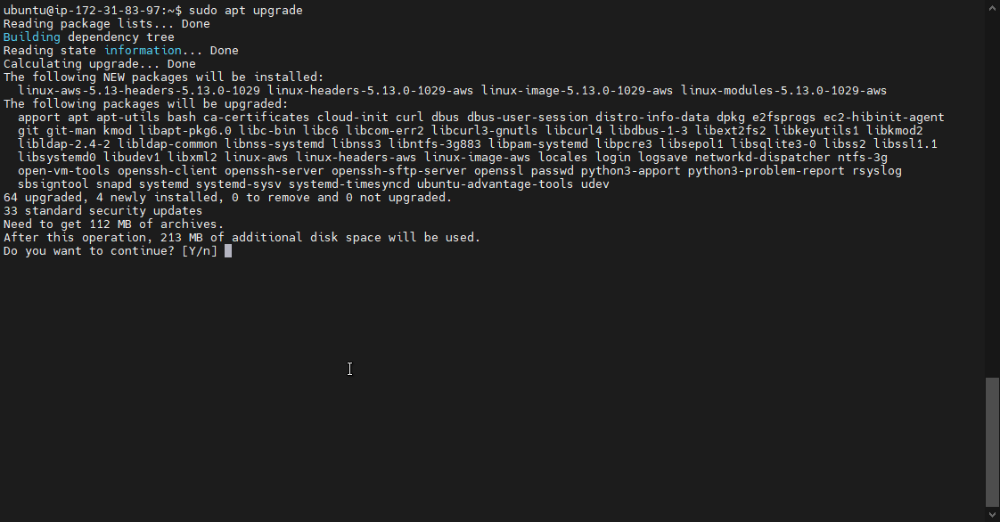

#### I added certificates

`sudo apt -y install curl dirmngr apt-transport-https lsb-release ca-certificates`

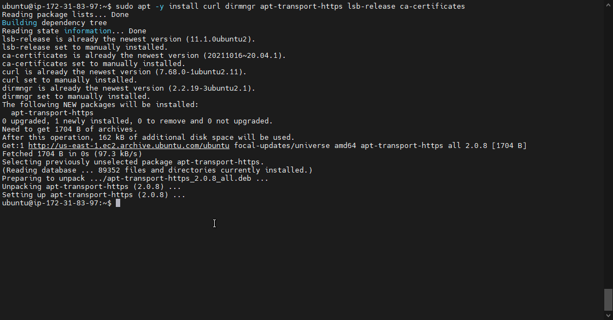

`curl -sL https://deb.nodesource.com/setup_12.x | sudo -E bash -`

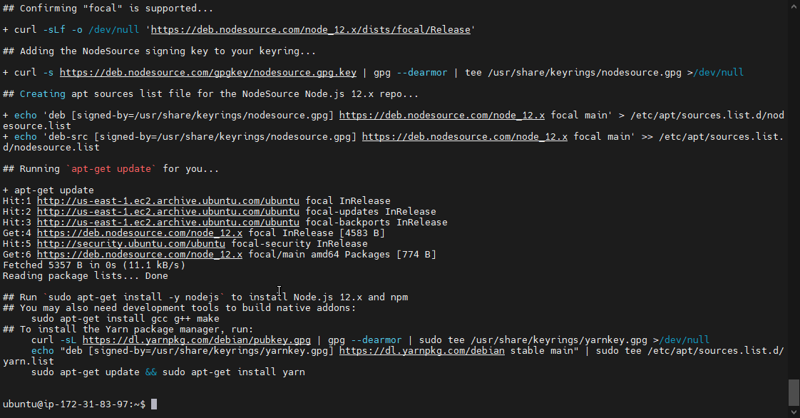

### I install NodeJS

`sudo apt install -y nodejs`

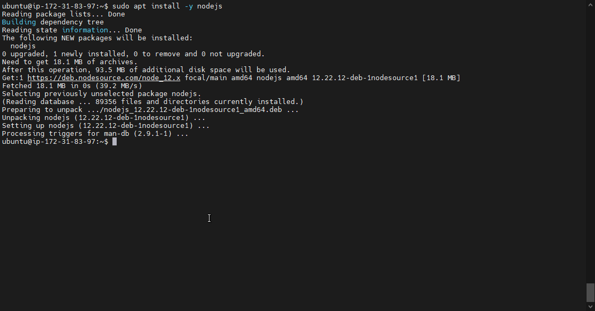

#### MongoDB stores data in flexible, JSON-like documents. Fields in a database can vary from document to document and data structure can be changed over time.

`sudo apt-key adv --keyserver hkp://keyserver.ubuntu.com:80 --recv 0C49F3730359A14518585931BC711F9BA15703C6`

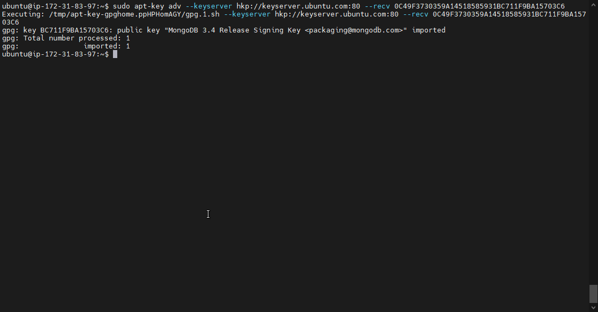

`echo "deb [ arch=amd64 ] https://repo.mongodb.org/apt/ubuntu trusty/mongodb-org/3.4 multiverse" | sudo tee /etc/apt/sources.list.d/mongodb-org-3.4.list`

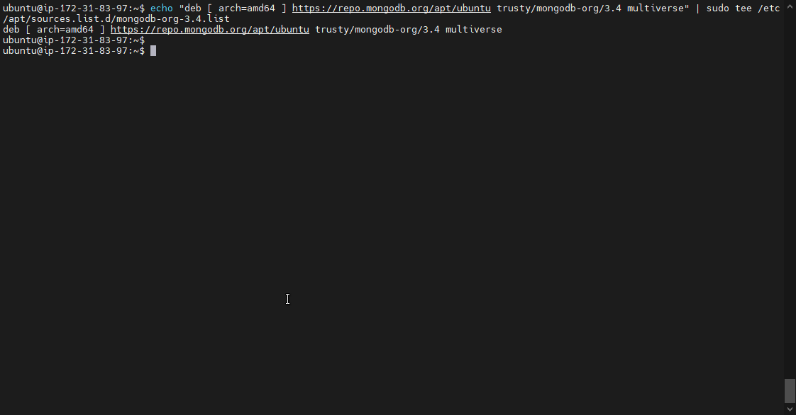

### Install MongoDB

`sudo apt install -y mongodb`

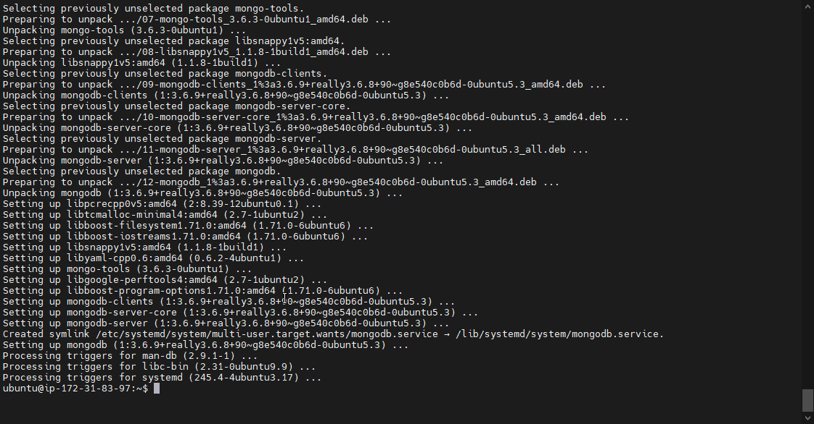

### Start The server

`sudo service mongodb start`

### Verify that the service is up and running

`sudo systemctl status mongodb`

### Install npm – Node package manager.
`sudo apt install -y npm`

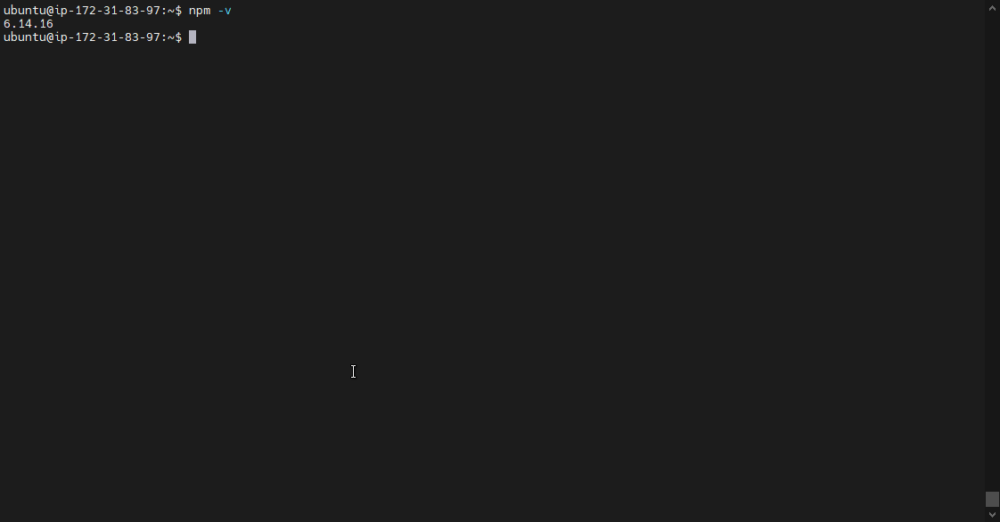

### Install body-parser package

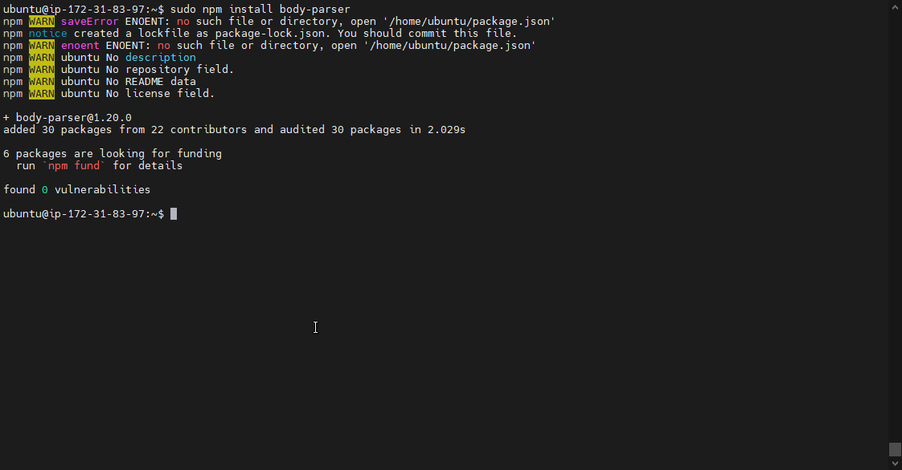

#### We need ‘body-parser’ package to help us process JSON files passed in requests to the server.

#### Create a folder named ‘Books’

`mkdir Books && cd Books`

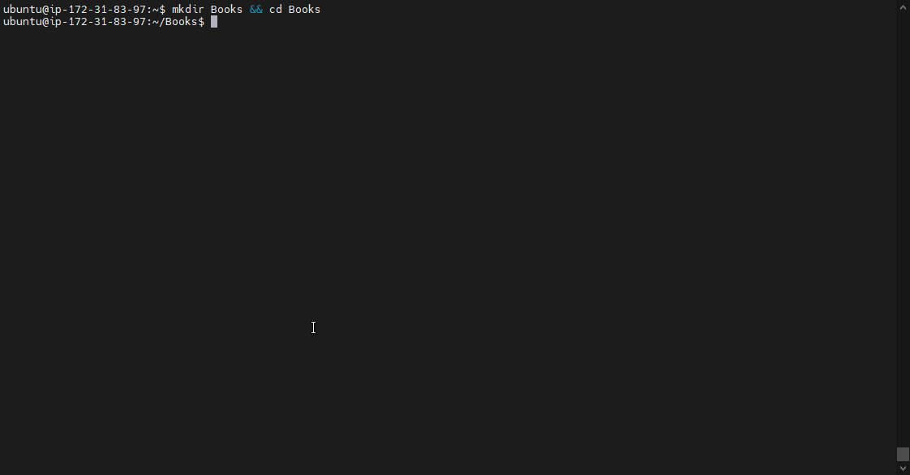

#### In the Books directory, Initialize npm project

`npm init`

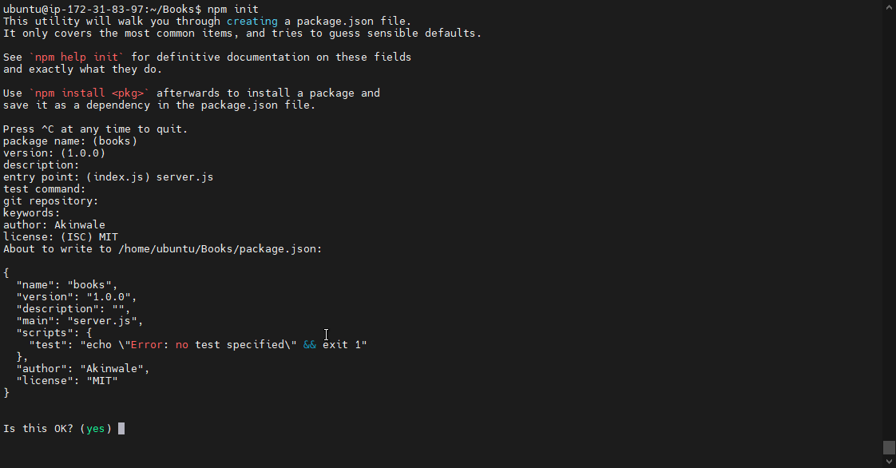

