## MEAN STACK IMPLEMENTATION
### Task
#### In this assignment I'm going to implement a simple Book Register web form using MEAN stack.

## Step 1: I will Install NodeJs
#### Node.js is a JavaScript runtime built on Chrome’s V8 JavaScript engine. Node.js is used in this tutorial to set up the Express routes and AngularJS controllers.

### First I will Update Ubuntu using the code below:

`sudo apt update`

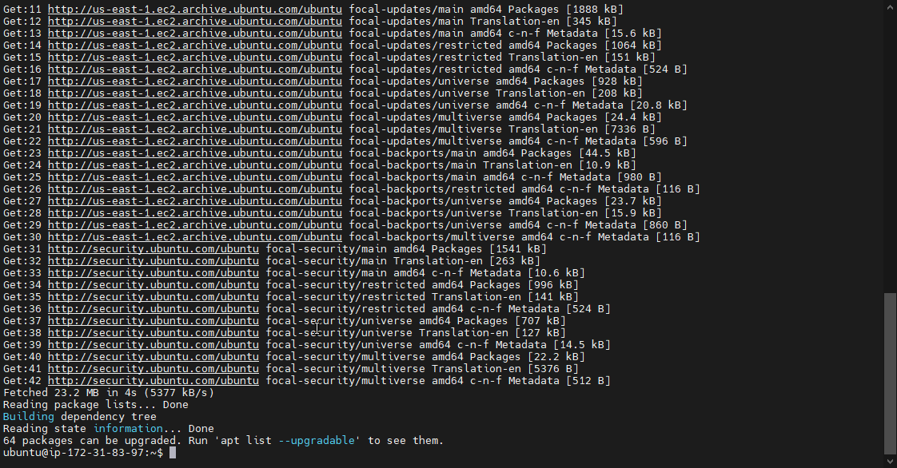

#### Secondly I will Upgrade ubuntu

#### I added certificates

`sudo apt -y install curl dirmngr apt-transport-https lsb-release ca-certificates`

`curl -sL https://deb.nodesource.com/setup_12.x | sudo -E bash -`

### I install NodeJS

`sudo apt install -y nodejs`

#### MongoDB stores data in flexible, JSON-like documents. Fields in a database can vary from document to document and data structure can be changed over time.

`sudo apt-key adv --keyserver hkp://keyserver.ubuntu.com:80 --recv 0C49F3730359A14518585931BC711F9BA15703C6`

`echo "deb [ arch=amd64 ] https://repo.mongodb.org/apt/ubuntu trusty/mongodb-org/3.4 multiverse" | sudo tee /etc/apt/sources.list.d/mongodb-org-3.4.list`

### Install MongoDB

`sudo apt install -y mongodb`

### Start The server

`sudo service mongodb start`

### Verify that the service is up and running

`sudo systemctl status mongodb`
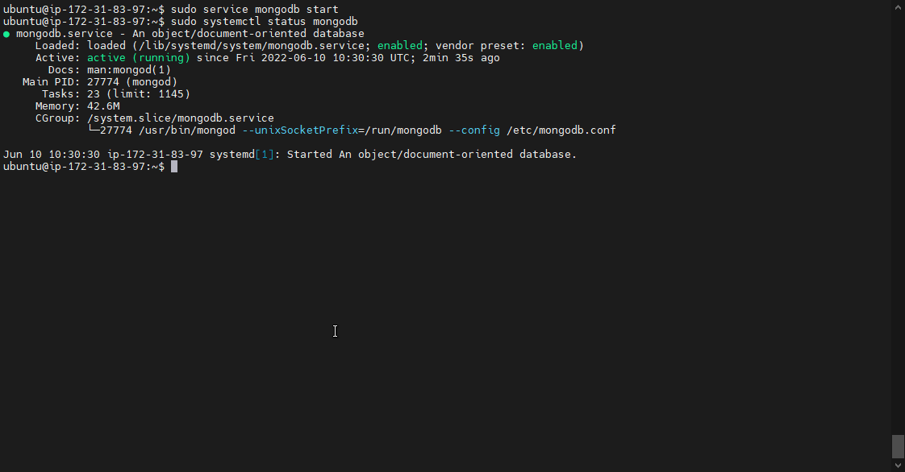

### Install npm – Node package manager.
`sudo apt install -y npm`

### Install body-parser package

#### We need ‘body-parser’ package to help us process JSON files passed in requests to the server.

#### Create a folder named ‘Books’

`mkdir Books && cd Books`

#### In the Books directory, Initialize npm project

`npm init`

#### Add a file to it named server.js

`server.js`

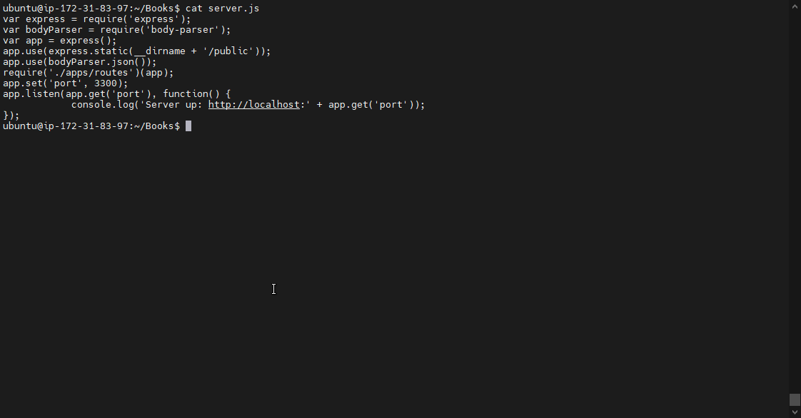

## INSTALL EXPRESS AND SET UP ROUTES TO THE SERVER

#### Express is a minimal and flexible Node.js web application framework that provides features for web and mobile applications. We will use Express in to pass book information to and from our MongoDB database.

#### We also will use Mongoose package which provides a straight-forward, schema-based solution to model your application data. We will use Mongoose to establish a schema for the database to store data of our book register.

`sudo npm install express mongoose`

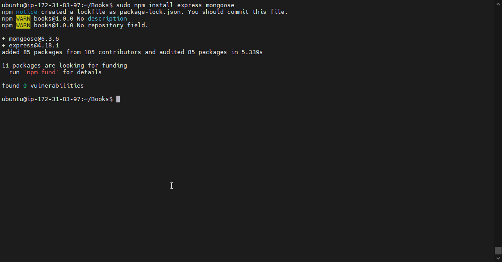

#### In ‘Books’ folder, create a folder named apps

`mkdir apps && cd apps`
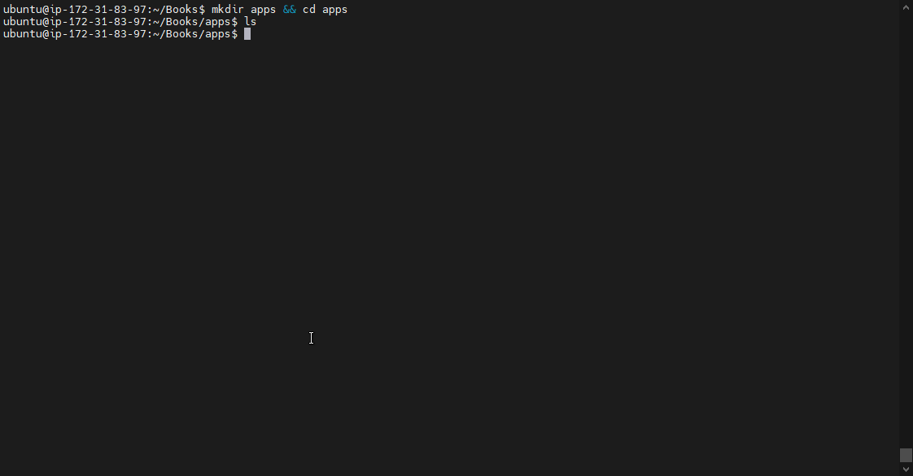

#### Create a file named routes.js
`vi routes.js`

#### In the ‘apps’ folder, create a folder named models
`mkdir models && cd models`

#### Create a file named book.js

`vi book.js`
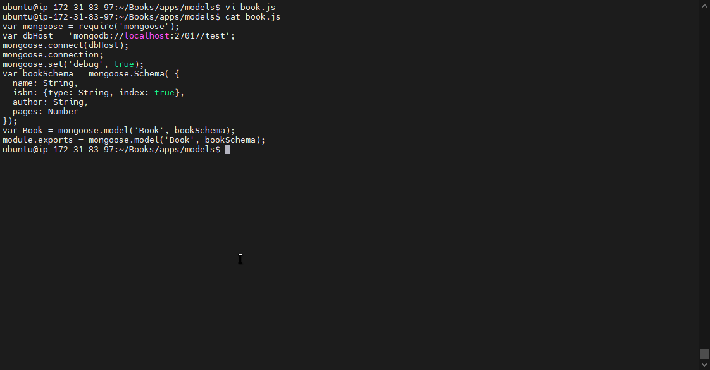

## Step 4 – Access the routes with AngularJS

#### AngularJS provides a web framework for creating dynamic views in your web applications. In this tutorial, we use AngularJS to connect our web page with Express and perform actions on our book register. Change the directory back to ‘Books’

#### Create a folder named public

`mkdir public && cd public`
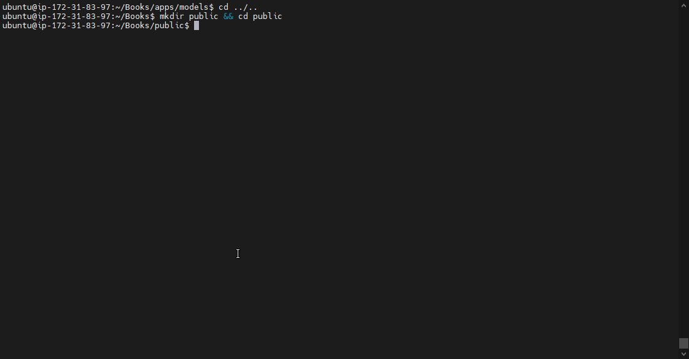

#### Add a file named script.js

`vi script.js`

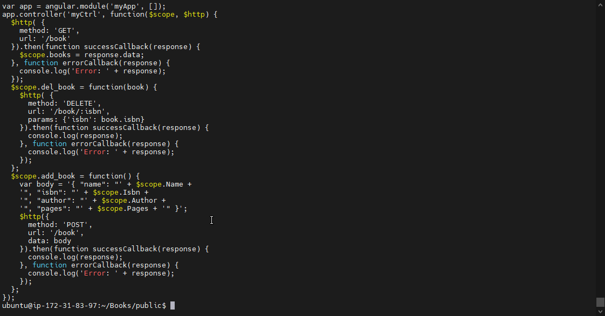

#### In public folder, create a file named index.html;
`index.html`

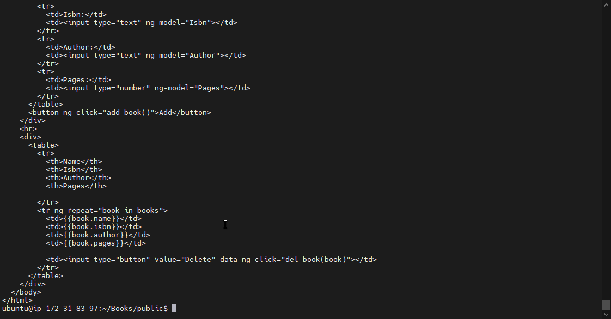

#### I Change the directory back up to Books

#### I Start the server by running this command:

`node server.js`

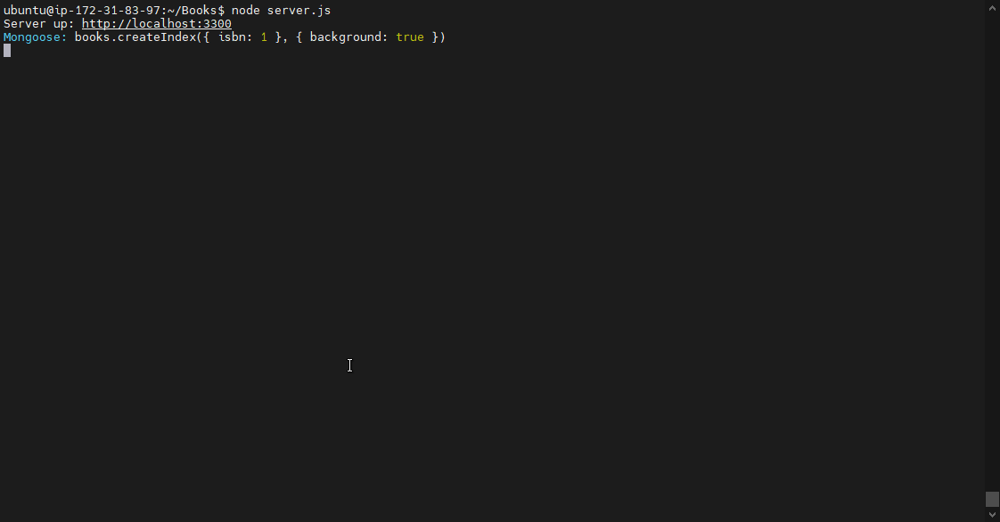

#### I open Port 3300 in my security group in other to access my webapps on the web, below is the final result

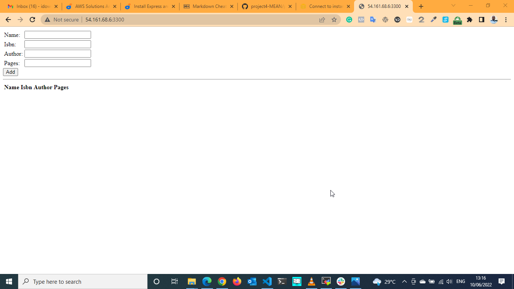
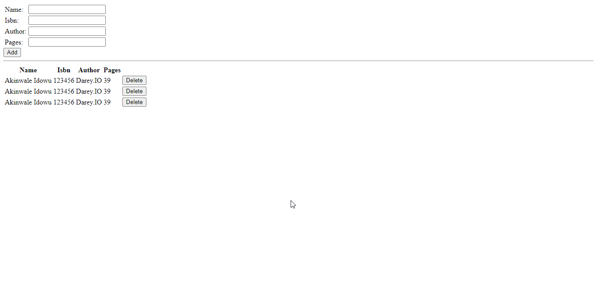

